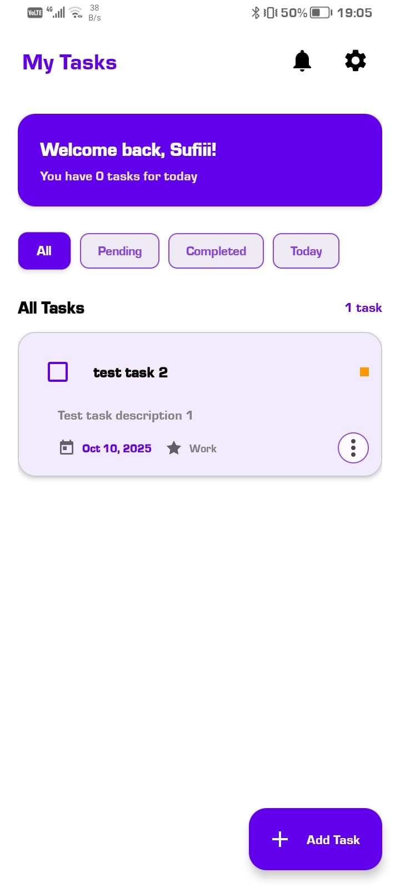
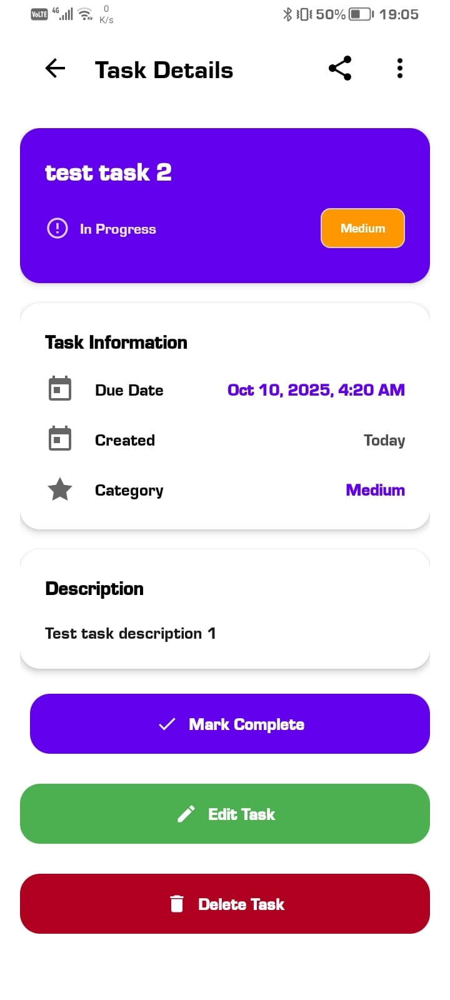
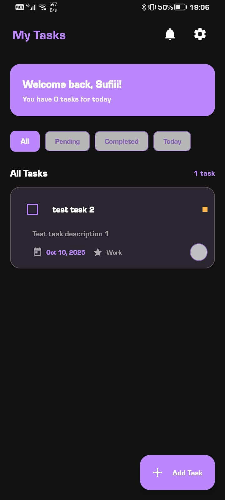
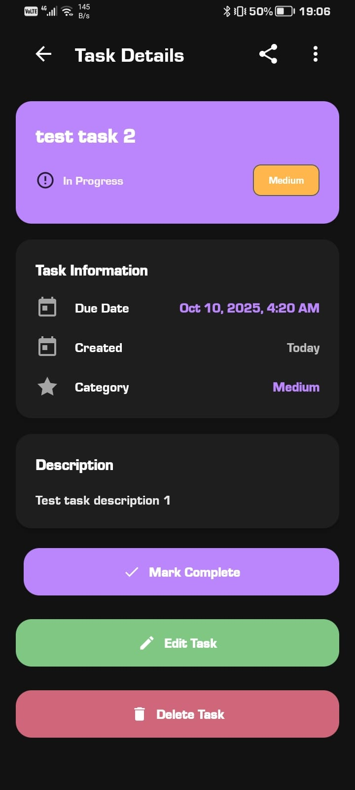
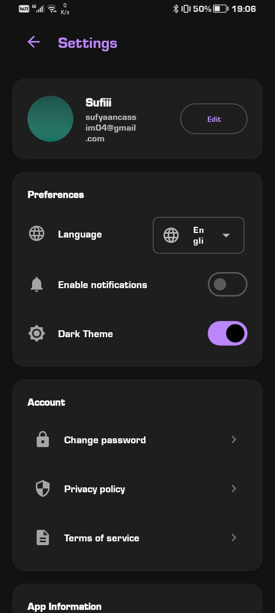

# 📱 TaskMaster - Modern Task Management App

A beautiful, feature-rich Android task management application built with Kotlin, Firebase, and Material Design 3.


## ✨ Features

### 🔐 Authentication & Security
- **User Registration & Login** with Firebase Authentication
- **Secure Password Management** with encrypted storage
- **Profile Management** with photo uploads
- **Password Change** functionality with re-authentication

### 📋 Task Management
- **Create, Edit, Delete Tasks** with full CRUD operations
- **Priority System** (High, Medium, Low) with color coding
- **Due Dates & Times** with intuitive date/time pickers
- **Task Descriptions** and detailed information
- **Reminder System** with customizable notifications
- **Smart Filtering** (All, Pending, Completed, Today)
- **Task Status Management** (Complete/Pending toggle)

### 🎨 User Interface
- **Modern Material Design 3** with beautiful gradient backgrounds
- **Dark/Light Theme** support with automatic switching
- **Multi-language Support** (English, Afrikaans, Zulu)
- **Responsive Design** for all screen sizes
- **Smooth Animations** and transitions
- **Professional Visual Design** with floating elements

### ⚙️ Settings & Customization
- **Language Switching** with instant updates
- **Theme Toggle** (Light/Dark mode)
- **Privacy Policy & Terms** with WebView integration
- **User Profile** management with photo uploads
- **Account Settings** and preferences

## 🛠️ Technical Stack

- **Language:** Kotlin
- **UI Framework:** Android Views with Material Design 3
- **Backend:** Firebase (Authentication, Firestore, Analytics)
- **Architecture:** MVVM with Repository Pattern
- **Dependencies:**
  - Firebase SDK (Auth, Firestore, Analytics)
  - Material Design Components 3
  - Gson for JSON serialization
  - Kotlin Coroutines for async operations
  - Navigation Component
  - SharedPreferences for local storage

## 📱 Screenshots

### Light Mode
| Home Screen                               | Task Details                                             | Settings                                          |
|-------------------------------------------|----------------------------------------------------------|---------------------------------------------------|
|  |  |  |

### Dark Mode
| Home Screen                             | Task Details                                            | Settings                                       |
|-----------------------------------------|---------------------------------------------------------|------------------------------------------------|
|  |  |  |

## 🚀 Getting Started

### Prerequisites
- Android Studio Arctic Fox or later
- Android SDK 24+
- Firebase project setup
- Java 8 or higher

### Installation
1. Clone the repository
```bash
git clone https://github.com/Sufyaan-Cassim/TaskMaster-Android-App.git
cd TaskMaster-Android-App
```

2. Open in Android Studio
3. Add your Firebase configuration file (`google-services.json`) to the `app/` directory
4. Sync project with Gradle files
5. Build and run the project

## 🔧 Firebase Setup

1. Create a Firebase project at [Firebase Console](https://console.firebase.google.com/)
2. Enable Authentication and Firestore Database
3. Download `google-services.json` from Project Settings
4. Place it in the `app/` directory
5. Configure Firestore security rules:

```javascript
rules_version = '2';
service cloud.firestore {
  match /databases/{database}/documents {
    // Allow authenticated users to read all tasks
    match /tasks/{document} {
      allow read: if request.auth != null;
      allow write: if request.auth != null && request.auth.uid == resource.data.userId;
    }
  }
}
```

## 🧪 Testing

The app includes comprehensive automated testing for core functionality:

### Unit Tests
- **Task Management**: CRUD operations, data validation, serialization
- **User Authentication**: Firebase integration, error handling
- **Data Models**: Task and Notification class testing
- **Repository Pattern**: Firebase Firestore operations
- **Edge Cases**: Invalid inputs, network failures, data corruption

### Test Coverage
- ✅ Task creation, updating, deletion
- ✅ User authentication flows
- ✅ Data validation and error handling
- ✅ Firebase integration testing
- ✅ UI component testing
- ✅ Notification system testing

### Running Tests
```bash
# Run all tests
./gradlew test

# Run specific test classes
./gradlew test --tests TaskTest
./gradlew test --tests TaskRepositoryTest

# Generate test report
./gradlew testDebugUnitTest
```

### GitHub Actions Testing
- **Automated Testing**: Runs on every push/PR
- **Multi-Environment**: Tests on different Android versions
- **Build Verification**: Ensures code compiles and runs
- **Test Reports**: Generated and stored as artifacts

## 📊 GitHub Actions

This project uses GitHub Actions for:
- Automated testing on every push
- Code quality checks
- Build verification
- Deployment automation

## 🏗️ Project Structure

```
app/
├── src/main/java/za/co/rosebankcollege/st10304152/taskmaster/
│   ├── data/                    # Data models and repositories
│   │   ├── Task.kt
│   │   ├── Notification.kt
│   │   └── TaskRepository.kt
│   ├── ui/                      # UI fragments and activities
│   │   ├── HomeFragment.kt
│   │   ├── SettingsFragment.kt
│   │   ├── NotificationsFragment.kt
│   │   └── ...
│   └── adapter/                 # RecyclerView adapters
│       ├── TaskAdapter.kt
│       └── NotificationAdapter.kt
├── src/main/res/               # Resources
│   ├── layout/                 # XML layouts
│   ├── drawable/               # Icons and backgrounds
│   ├── values/                 # Strings, colors, themes
│   └── navigation/             # Navigation graphs
└── google-services.json        # Firebase configuration
```

## 🤖 AI Tools Usage

This project utilized AI assistance for development and debugging:

**AI Tools Used:**
- **Claude Sonnet 4** for code generation, debugging, and architectural guidance
- **GitHub Copilot** for code completion and suggestions
- **ChatGPT** for initial project planning and documentation

**Specific AI Contributions:**
- Firebase integration setup and configuration
- Material Design 3 implementation and theming
- Unit test creation and debugging
- GitHub Actions CI/CD pipeline configuration
- Code optimization and error resolution
- Documentation and README enhancement

**Code Examples:**
```kotlin
// AI-assisted Firebase repository implementation
class TaskRepository(private val firestore: FirebaseFirestore) {
    suspend fun addTask(task: Task): Result<Task> {
        return try {
            firestore.collection(COLLECTION_TASKS)
                .document(task.id)
                .set(task)
                .await()
            Result.success(task)
        } catch (e: Exception) {
            Result.failure(e)
        }
    }
}
```

**AI Citation:** All AI-generated code has been reviewed, tested, and integrated following best practices. AI tools were used as development assistants, not as primary code generators.

## 📄 License

This project is licensed under the MIT License - see the [LICENSE](LICENSE) file for details.

## 👨‍💻 Team Members

- Sufyaan Cassim | ST10304152
- Mukethwa Susan Mukhoro | ST10400833
- Sijongokuhle Kungawo Jikijela | ST10374043
- Ntokoza Mayisela | ST10270987

## 📺 Demo Video

[🎥 Watch the complete app demonstration video](https://youtu.be/u1rUb_OXvaQ)

*The video should showcase:*
- ✅ User registration and login process
- ✅ Password encryption demonstration
- ✅ Settings management and customization
- ✅ Firebase database connection and data storage
- ✅ Task management features (CRUD operations)
- ✅ Theme switching (Light/Dark mode)
- ✅ Professional voice-over explanation

---

**Built with ❤️ for modern task management**

*This project was developed as part of an academic assessment demonstrating modern Android development practices, Firebase integration, and professional software engineering skills.*